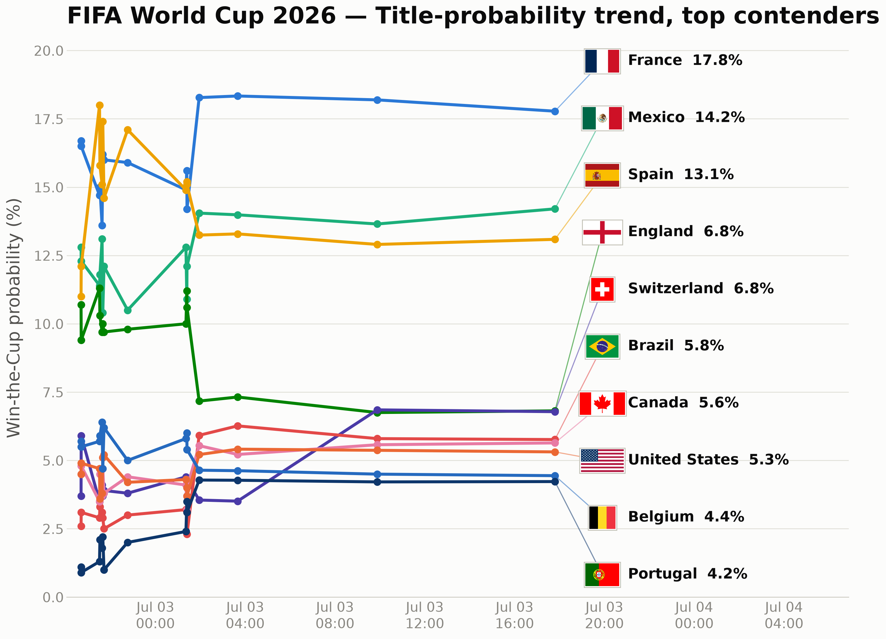
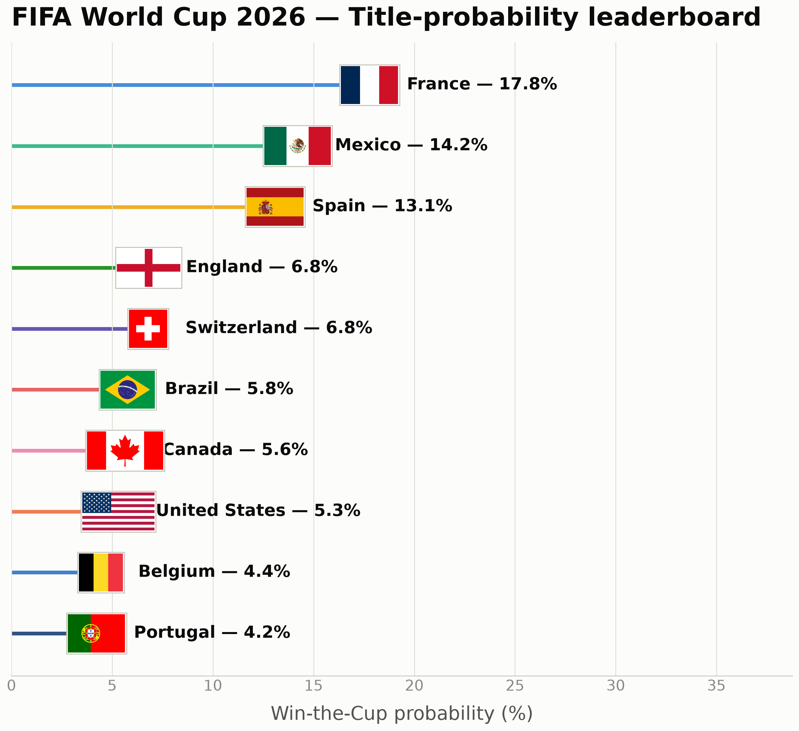
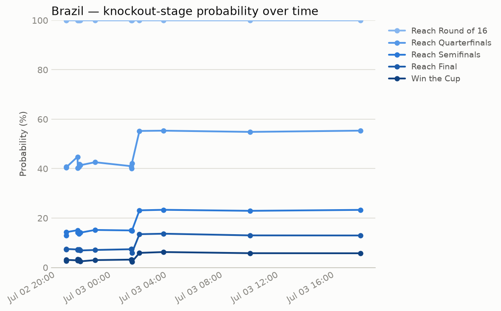
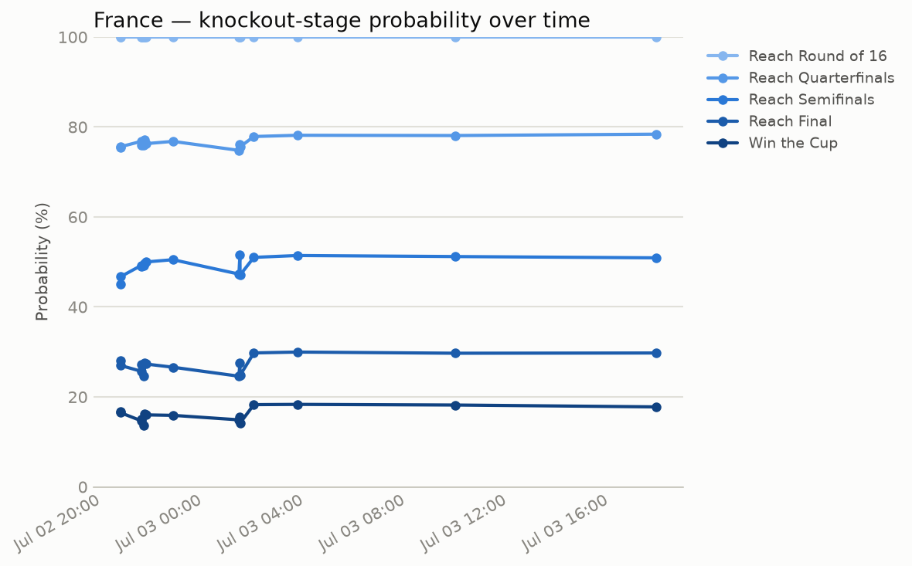
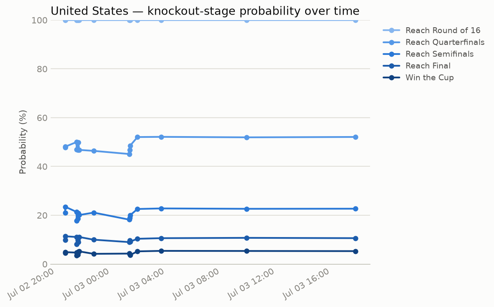
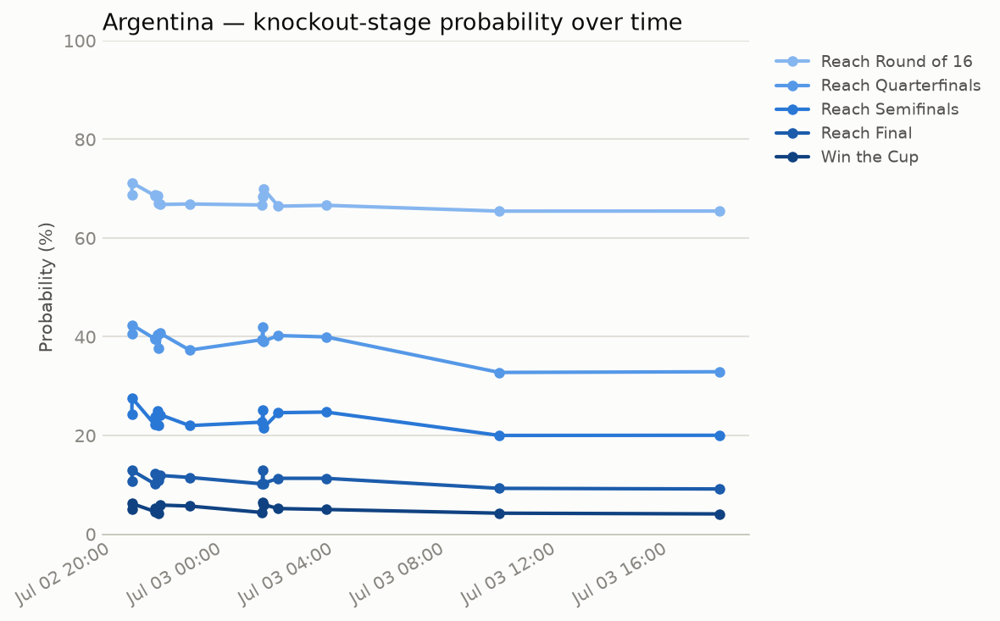
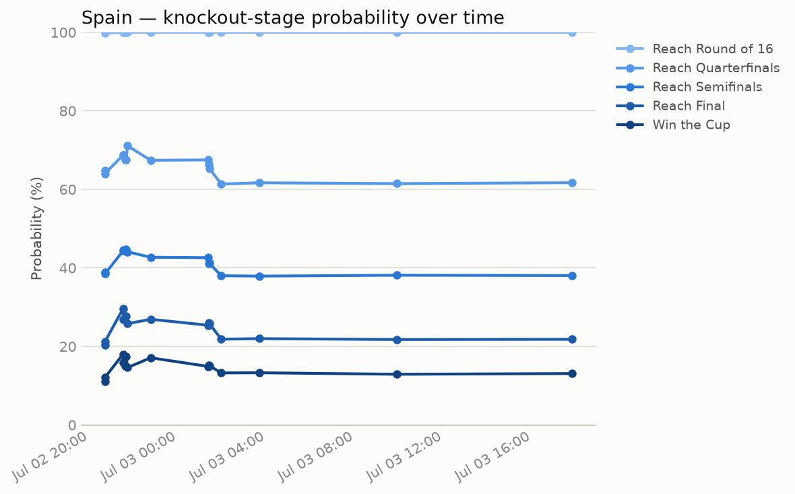

# FIFA 2026 Knockout-Phase Monte Carlo Model

<!-- RESULTS:START -->
_Last updated: **2026-07-03 13:47:49 EDT** by [GitHub Actions run #28675908852](https://github.com/pedroliman/fifa26-knockout-model/actions/runs/28675908852) (schedule) — 50000 simulated trajectories, fit on 911 qualifiers + 72 group + 13 completed knockout matches._





## Current standings

| Team | R16 | QF | SF | Final | Champion |
|---|---:|---:|---:|---:|---:|
| France | 100.0% | 78.4% | 50.9% | 29.8% | **17.8%** |
| Mexico | 100.0% | 58.2% | 37.4% | 24.8% | **14.2%** |
| Spain | 100.0% | 61.7% | 38.0% | 21.8% | **13.1%** |
| England | 100.0% | 41.8% | 23.5% | 14.0% | **6.8%** |
| Switzerland | 100.0% | 55.4% | 33.7% | 15.2% | **6.8%** |
| Brazil | 100.0% | 55.4% | 23.3% | 13.0% | **5.8%** |
| Canada | 100.0% | 57.6% | 25.5% | 11.6% | **5.6%** |
| United States | 100.0% | 52.1% | 22.7% | 10.6% | **5.3%** |
| Belgium | 100.0% | 47.9% | 20.5% | 9.3% | **4.4%** |
| Portugal | 100.0% | 38.3% | 18.8% | 8.5% | **4.2%** |
| Argentina | 65.5% | 32.9% | 20.0% | 9.2% | **4.1%** |
| Norway | 100.0% | 44.6% | 15.8% | 8.4% | **3.3%** |
| Morocco | 100.0% | 42.4% | 16.4% | 6.5% | **2.8%** |
| Colombia | 53.4% | 28.8% | 12.6% | 4.5% | **1.7%** |
| Egypt | 54.4% | 27.0% | 11.2% | 3.9% | **1.3%** |
| Ghana | 46.6% | 23.7% | 9.8% | 3.4% | **1.1%** |
| Australia | 45.6% | 20.5% | 7.6% | 2.3% | **0.7%** |
| Paraguay | 100.0% | 21.6% | 7.2% | 2.0% | **0.6%** |
| Cape Verde | 34.5% | 11.7% | 5.2% | 1.4% | **0.4%** |
| Ivory Coast | 0.0% | 0.0% | 0.0% | 0.0% | **0.0%** |
| Sweden | 0.0% | 0.0% | 0.0% | 0.0% | **0.0%** |
| Germany | 0.0% | 0.0% | 0.0% | 0.0% | **0.0%** |
| Bosnia-Herzegovina | 0.0% | 0.0% | 0.0% | 0.0% | **0.0%** |
| Croatia | 0.0% | 0.0% | 0.0% | 0.0% | **0.0%** |
| Netherlands | 0.0% | 0.0% | 0.0% | 0.0% | **0.0%** |
| South Africa | 0.0% | 0.0% | 0.0% | 0.0% | **0.0%** |
| Congo DR | 0.0% | 0.0% | 0.0% | 0.0% | **0.0%** |
| Austria | 0.0% | 0.0% | 0.0% | 0.0% | **0.0%** |
| Algeria | 0.0% | 0.0% | 0.0% | 0.0% | **0.0%** |
| Japan | 0.0% | 0.0% | 0.0% | 0.0% | **0.0%** |
| Ecuador | 0.0% | 0.0% | 0.0% | 0.0% | **0.0%** |
| Senegal | 0.0% | 0.0% | 0.0% | 0.0% | **0.0%** |

## Team spotlight

### Brazil

Round of 32: won 2-1 vs Japan.

| Stage | P(reach) |
|---|---:|
| Round of 16 | 100.0% |
| Quarterfinals | 55.4% |
| Semifinals | 23.3% |
| Final | 13.0% |
| **Win the Cup** | **5.8%** |

Most likely single outcome: **Round of 16** (44.6%).



### France

Round of 32: won 3-0 vs Sweden.

| Stage | P(reach) |
|---|---:|
| Round of 16 | 100.0% |
| Quarterfinals | 78.4% |
| Semifinals | 50.9% |
| Final | 29.8% |
| **Win the Cup** | **17.8%** |

Most likely single outcome: **Quarterfinals** (27.5%).



### United States

Round of 32: won 2-0 vs Bosnia-Herzegovina.

| Stage | P(reach) |
|---|---:|
| Round of 16 | 100.0% |
| Quarterfinals | 52.1% |
| Semifinals | 22.7% |
| Final | 10.6% |
| **Win the Cup** | **5.3%** |

Most likely single outcome: **Round of 16** (47.9%).



### Argentina

Round of 32: upcoming vs Cape Verde (2026-07-03T22:00Z).

| Stage | P(reach) |
|---|---:|
| Round of 16 | 65.5% |
| Quarterfinals | 32.9% |
| Semifinals | 20.0% |
| Final | 9.2% |
| **Win the Cup** | **4.1%** |

Most likely single outcome: **Round of 32** (34.5%).



### Spain

Round of 32: won 3-0 vs Austria.

| Stage | P(reach) |
|---|---:|
| Round of 16 | 100.0% |
| Quarterfinals | 61.7% |
| Semifinals | 38.0% |
| Final | 21.8% |
| **Win the Cup** | **13.1%** |

Most likely single outcome: **Round of 16** (38.3%).



<!-- RESULTS:END -->

A self-contained model of the FIFA World Cup 2026 knockout stage (Round of 32
through the Final). Every run fetches live data, refits team strength, and
simulates the rest of the tournament 50,000 times.

The **Current standings** and **Team spotlight** sections above are
regenerated automatically by a GitHub Action — see
[Automation](#automation) below. Everything below this point is static
documentation of how the model works.

```
python -m fifa_sim team Brazil
python -m fifa_sim team Brazil --plot
python -m fifa_sim simulate
python -m fifa_sim bracket
```

## What it does

1. **Pulls live data from ESPN's public soccer API** (no key required):
   2026 World Cup qualifying results for all six confederations (UEFA,
   CONMEBOL, CONCACAF, CAF, AFC, OFC), group-stage results, every
   completed/live/upcoming knockout fixture, and the current score + game
   clock for matches in progress. ESPN uses one global team-id namespace
   across all of these competitions, so a qualifier result for team "164"
   (Spain) joins directly onto its World Cup rows -- no name-matching
   needed.
2. **Reconstructs the bracket graph from the data itself** — not
   hardcoded. ESPN pre-creates a fixture for every bracket slot before the
   occupants are known (e.g. a Round-of-16 game shows `"Round of 32 11
   Winner"` as a placeholder participant until that Round-of-32 match
   finishes). We sort each round's fixtures by event id to recover the
   official slot numbers, parse those placeholder strings, and wire each
   match to the two matches that feed it. This means the bracket always
   reflects whatever FIFA/ESPN currently has scheduled, including if a game
   goes to a replay slot or kickoff times shift.
3. **Fits a Poisson attack/defense rating per team** (`fifa_sim/ratings.py`)
   from every qualifying, group-stage, and completed-knockout match played
   so far — a ridge-regularized Maher/Dixon-Coles-style model:
   `lambda_home = exp(mu + attack_home - defense_away + venue terms)`.
   Two venue terms are fit from the data, each active in exactly one kind
   of match: a shared **home advantage** for the home side in qualifiers
   (genuine home/away fixtures — without it, a team's home edge leaks into
   its attack rating and gets carried onto neutral World Cup pitches), and
   a **host boost** for USA/Mexico/Canada in this tournament's matches
   (neutral venue for everyone else). Every match is exponentially
   down-weighted by how long ago it was played (120-day half-life), so
   recent form dominates and stale qualifier results fade as the
   tournament's own matches pile up. Ridge shrinkage on top of that still
   matters early in the tournament, when a team might have only 3-6 *World
   Cup* games — without it, a single 5-0 win would make a team look
   unrealistically dominant.
4. **Simulates each remaining match** with Poisson-distributed goals for
   normal time, then extra time (same per-minute intensity) if still level,
   then a 50/50 penalty shootout if still level after that — matching actual
   knockout-match rules (no away goals, no replays). For matches that
   haven't kicked off, the advance probability is computed *exactly* from
   the Poisson score grid (`fifa_sim/match_engine.py::advance_probability`)
   and cached per pairing, so each trajectory resolves the match with a
   single Bernoulli draw — same distribution as sampling the goals, minus
   the sampling noise.
5. **Respects live match state**: if a match is in progress, the model
   keeps the actual current score fixed and only simulates the *remaining*
   clock time (using the live period/clock from ESPN), so a goal scored
   right now immediately shifts every downstream probability the next time
   you run the CLI.
6. **Runs 50,000 Monte Carlo trajectories** through the whole bracket,
   propagating simulated winners (and, for semifinals, losers, for the
   3rd-place match) round by round, and tallies:
   - P(team reaches Round of 16 / QF / SF / Final)
   - P(team wins the Cup)
7. **Snapshots every run** to `data/history/snapshots.jsonl` (timestamped),
   so `--plot` can chart a team's probabilities evolving over time as new
   results come in. Re-run the CLI whenever you want an updated read (after
   a goal, at halftime, the next matchday, etc.) — every run re-fetches
   fresh data and re-fits the model, nothing is cached.

## Design choices & assumptions (read before trusting the numbers)

- **No external Elo/ranking prior.** Ratings are fit purely from ESPN match
  data (qualifiers + 2026 World Cup) via recency-weighted, ridge-shrunk MLE —
  deliberately self-contained (one data source for both fixtures and
  history) rather than depending on a separate, hard-to-verify ranking feed.
  Qualifiers substantially reduce (but don't eliminate) the small-sample
  noise for teams early in the World Cup bracket.
- **Hyperparameters are backtested, not guessed.** The ridge strength and
  recency half-life were chosen by fitting on the data available before
  each stage of this tournament and scoring the predicted win/draw/loss
  probabilities of the 84 World Cup matches actually played (mean
  log-loss). The search found a shallow optimum at ridge ≈ 2 with a
  ~90-120-day half-life — recent form simply predicts better than year-old
  qualifier results — improving out-of-sample log-loss from 1.12 (old
  365-day, no-home-advantage setup) to 1.03. A Dixon-Coles low-score
  dependency term was tried in the same harness and did not help
  out-of-sample, so it's deliberately omitted.
- **Home advantage in qualifiers** is modeled with a single shared term
  (fit ≈ +0.24 log-goals, in line with the soccer literature), applied only
  in home/away qualifying fixtures; World Cup matches are treated as
  neutral-venue.
- **Host advantage**: a single shared boost term for the USA/Mexico/Canada
  (this tournament's three co-hosts) is fit from the data rather than
  assumed, and applied only in this tournament's matches — so the hosts'
  home qualifiers don't double-count it.
- **Extra time** is modeled at the same goals-per-minute rate as normal
  time (a simplifying assumption; some research suggests fatigue lowers
  scoring rates in ET, but the effect is small and contested).
- **Penalty shootouts are a coin flip.** Deliberately not a function of
  team strength — shootout outcomes are well-documented in the literature
  as close to unpredictable from run-of-play ability.
- **Stoppage time is ignored** in the live-match clock model (matches are
  treated as ending at exactly 90/120 minutes); the effect on remaining-time
  estimates is minor.
- 50,000 trajectories gives Monte Carlo error of roughly ±0.2 percentage
  points (at p≈0.5) on any given probability, so the README numbers move
  smoothly between runs instead of jittering. Because not-yet-started
  matches resolve via one cached, analytically exact advance probability
  per pairing (rather than sampling goals every trajectory), the full 50k
  run takes only a couple of seconds — bump it further via `--n` if you
  like.

## Automation

`.github/workflows/update-knockout-stats.yml` runs `scripts/update_readme.py`
on a 15-minute cron (plus manual `workflow_dispatch`) for the duration of the
knockout stage (2026-06-27 through 2026-07-20; the workflow no-ops outside
that window to avoid burning Actions minutes for the rest of the year).

Most ticks are a no-op. `fifa_sim/scheduler.py` keeps a small state file
(`data/state/match_status.json`) of each bracket match's last-seen status
and only triggers the expensive path — refetch qualifiers/group/knockout,
refit ratings, run 50,000 trajectories, rewrite the README, regenerate charts,
commit, push — when:

- a match is scheduled to kick off within the next 20 minutes (**before**), or
- a match has transitioned to finished since the last update (**after**).

So every scheduled game gets a stats refresh shortly before kickoff and
again the moment it ends, plus README updates for both. A manual run via
`workflow_dispatch` always forces a refresh regardless of the trigger
conditions.

Every refresh timestamps the README (`_Last updated: ..._`, shown in US
Eastern time -- `America/New_York` via `zoneinfo`, so it reads EST or EDT
correctly depending on the time of year) and links back to the GitHub
Actions run that produced it (`fifa_sim/report.py::_run_provenance`, via
the `GITHUB_RUN_ID`/`GITHUB_SERVER_URL` env vars GitHub sets automatically)
so you can always tell exactly which run last touched the numbers — it
falls back to "local/manual run" when the script is run outside CI.

Two flag-illustrated, large-type charts (`fifa_sim/plotting.py`,
`fifa_sim/flags.py`) sit at the top of the results, sized to be
screenshotted straight into a social post:

- **Title-probability trend** — a time series of Win-the-Cup probability
  for the current top 10 teams, one line per team, with an evenly spaced
  label rail (flag + name + %) on the right so labels never collide even
  when several teams are bunched together.
- **Title-probability leaderboard** — a lollipop chart of the same set,
  each stem tipped with the team's flag.

Both always include Brazil (`fifa_sim/report.py::ALWAYS_INCLUDE_SOCIAL`),
appended after the top 10 on any run where they don't make it on merit —
edit that tuple to always-include different teams.

Flags are fetched once from flagcdn.com (by ISO 3166-1 code, England/
Scotland/Wales via flagcdn's subdivision codes) and cached under
`data/cache/flags/`.

The **Team spotlight** section tracks five teams: Brazil, France, the
United States, Argentina, and Spain (`fifa_sim/report.py::TRACKED_TEAMS`) —
edit that list to track different teams. The general leaderboard and the
two social charts cover all 32 Round-of-32 teams / the current top 10
regardless.

## Project layout

```
fifa_sim/
  espn_client.py   HTTP layer + raw event parsing (ESPN's public JSON API)
  bracket.py       Builds the bracket graph from event data (slot numbers,
                   placeholder parsing, feeder wiring)
  ratings.py       Poisson attack/defense model fit (scipy L-BFGS-B)
  match_engine.py  Single-match simulation: normal time -> ET -> penalties,
                   including "resume from a live score + clock" mode
  simulator.py     Monte Carlo loop over the whole bracket
  pipeline.py      Glues fetch -> fit -> bracket into one `build_snapshot()`
  history.py       Append/read timestamped snapshots (for the time-series plots)
  plotting.py      matplotlib charts: per-team history, top-10 trend, lollipop
  flags.py         Fetches + caches team flag PNGs (flagcdn.com) for the charts
  team_status.py   Shared "find team / current match / exit distribution"
                   helpers used by both the CLI and the README report
  report.py        Renders the Markdown block injected into README.md
  scheduler.py      Decides whether a refresh is due right now (see Automation)
  cli.py           `team` / `simulate` / `bracket` subcommands
scripts/
  update_readme.py  Entry point the GitHub Action runs
data/
  history/snapshots.jsonl   append-only run history
  plots/                    generated charts (5 tracked teams + 2 social charts)
  state/match_status.json   last-seen status per bracket match
  cache/flags/              cached flag PNGs
.github/workflows/
  update-knockout-stats.yml   the scheduled/on-demand automation
```

## Requirements

```
pip install -r requirements.txt   # numpy, scipy, matplotlib
```

No API key needed — the ESPN scoreboard endpoint used here
(`site.api.espn.com/apis/site/v2/sports/soccer/fifa.world/...`) is public.